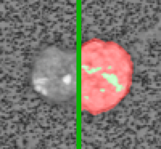

<div align="center">

# 🔬 Cell Infiltrations



**Quantify cell infiltration patterns in microscopy images with precision**

A desktop application for analyzing histology samples and computing infiltration statistics through computer vision algorithms.

[](LICENSE)
[](https://www.python.org/)
[](https://github.com/pierreadorni/infiltrations/releases)

</div>

---

## ✨ Features

- 🖼️ **Batch Image Processing** - Load and analyze multiple TIFF/PNG/JPG images
- 🎯 **Interactive Segmentation** - Click to delete/restore infiltration regions
- 📊 **Real-time Statistics** - Automatic calculation of infiltration percentages
- 🔧 **Fine-tuned Parameters** - Sliders for gray filter sensitivity and white threshold
- 🐛 **Debug Visualization** - 6-panel grid for algorithm inspection
- 📈 **CSV Export** - Export results with per-image and aggregate statistics
- 🚀 **Single Executable** - No installation or Python required

## 🚀 Quick Start

### Download Pre-built Executable

Visit the [Releases page](../../releases) and download the executable for your OS:

- **Linux**: `Cell_Infiltrations_linux_py3.11.tar.gz`
- **macOS**: `Cell_Infiltrations_macos_*.zip` (Intel or Apple Silicon)
- **Windows**: `Cell_Infiltrations_windows_*.zip` (32-bit or 64-bit)

Extract and run—no installation needed!

### Run from Source

```bash
# Clone repository
git clone <repo-url>
cd guyot_infiltrations

# Install dependencies
pip install -r requirements.txt

# Run application
python main.py

# Or debug mode (shows algorithm steps)
python main.py --debug
```

## 📖 Usage

1. **Load Images**: Click "Select Folder" to choose a directory with microscopy images
2. **Navigate**: Use Previous/Next buttons to browse images
3. **Adjust Parameters**:
   - **Gray Filter Iterations** (1-15): Controls gray region sensitivity
   - **White Threshold** (100-254): Adjusts infiltration detection threshold
4. **Interactive Editing**: Click infiltration regions to delete/reinstate them
5. **Export Results**: Click "Export CSV" to save statistics

## 🏗️ Architecture

**Single-file application** (~600 lines) with:
- Image processing pipeline (gamma correction, mask extraction, visualization)
- Tkinter GUI with per-image state management
- OpenCV-based computer vision algorithms

See [`.github/copilot-instructions.md`](.github/copilot-instructions.md) for technical details.

## 🛠️ Development

### Building Executables

**Local build** (any platform):
```bash
# macOS/Linux
./build.sh

# Windows
build.bat
```

**Automated builds** (GitHub Actions):
- Push to `main` → artifacts retained 30 days
- Push tag `v*.*.*` → creates GitHub Release with all binaries

See [`BUILD_DISTRIBUTION.md`](BUILD_DISTRIBUTION.md) for details.

### Testing & Prototyping

- **Jupyter Notebook**: `tests_classic_cv.ipynb` for algorithm development
- **Debug Mode**: `python main.py --debug` shows intermediate processing steps
- **Sample Data**: 13 TIFF images in `data/` for testing

## 📚 Documentation

- [`DISTRIBUTION.md`](DISTRIBUTION.md) - Download and run pre-built executables
- [`BUILD_DISTRIBUTION.md`](BUILD_DISTRIBUTION.md) - CI/CD pipeline details
- [`PYINSTALLER_CONFIG.md`](PYINSTALLER_CONFIG.md) - Advanced build configuration
- [`DISTRIBUTION_SETUP.md`](DISTRIBUTION_SETUP.md) - Complete setup guide

## 🔧 Requirements

- **Python 3.10+** (if building from source)
- **Dependencies**: numpy, opencv-python, pillow, tkinter (included with Python)

## 📦 What's Included

| File | Purpose |
|------|---------|
| `main.py` | Full application (GUI + processing) |
| `build.spec` | PyInstaller configuration |
| `requirements.txt` | Python dependencies |
| `tests_classic_cv.ipynb` | Algorithm prototyping notebook |

## 📄 License

[MIT License](LICENSE) - See LICENSE file for details.

## 📬 Support

For issues and questions, please open a GitHub issue.

---

